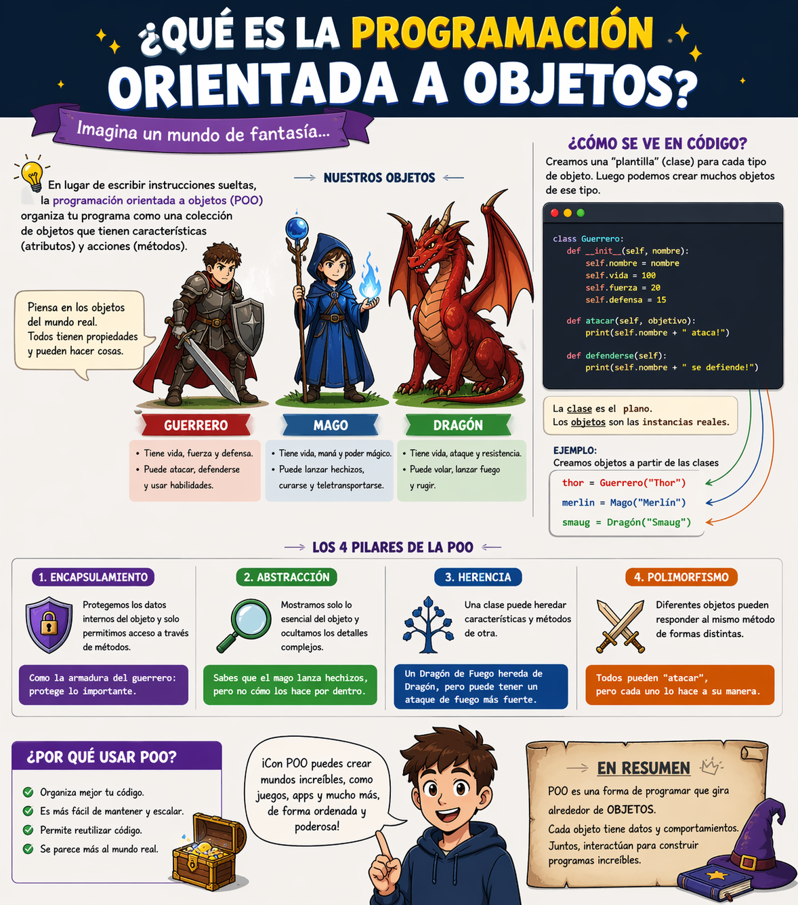

# # POO en python


## ¿Por qué aprender POO? 
- Imagina que quieres crear un videojuego tienes guerreros dragones magos... cada uno con sus propios puntos de vida ataque y habilidades ¿Como las organizas en codigo sin repetir todo una y otra vez?
- La **Programación Oriental a objetos (POO)** es la respuesta. En lugar de escribir instrucciones sueltas modales a el mundo real con *objestos* que tienen caracteristicas y comportamientos. Es la forma en que estan construidos la mayoria de los programas profesionales en el mundo



## Clases y objetos
- Una clase es un tipo de datos cuyas variables se llaman objetos o instancias

- La clase es la definicion del concepto del mundo real y los objetos o instancias son el propio "objeto" del mundo real

- Las clases estan compuestas por dos elementos:
- **Atributos:** informacion que almacena la clase
- **Metodos:** operaciones que realizarce con la clase

## Definicion de una clase enn Python
``` python
class Nombreclase:
    def__init__(self, variables1, variable2):
        self.atributo1 = valor1
        self.atributo2 = valor2

        def nombreMetodo(self1):
            Bloque codigo
```
- `class` : palabra reservada en Python para definir una clase
- `NombreClase` : nombre de la clase que se quiere crear
- `def` : palabra reservada en Python que se usa par definir tanto el constructor de la clase, como los diferentes metodos que tiene
- `__init__` : palabra reservada en Python para definir el metodo constructor de la clase. El metodo `__init__` es lo primero que se ejecuta cuando creas un objeto de una clase
- `(self, variableX)` : parametro del constructor de la clase el parametro `self` es obligatorio y despues puedes tener tantos parametros como quieras. 
- `self.atributoX` : forma de utlizacion y acceso a los atributos de la clase
`nombreMetodo` : nombre de metodo de la clase
`self`: parametro del metodo. El parametro `self` es obligatorio y despues puedes tener tantos parametros como quieras.
- `BloqueCodigo` : funciones que ejecutara el metodo

**Al definir una clase tenga en cuenta**
- Puede definir tantos  atributos como necesites
- Puede definir tantos  metodos como necesites
- Puede definir tantos  parametros en el constructor y en los metodos como necesites

## Ejemplo
- Atributos: nombre, apellidos, y edad
- Metodos: mostrar la información de la persona

### Codigo

```python
class persona:

    def __init__(self, nombre,apellido, edad):
        self.nombre = nombre
        self.apeliido = apellido
        self.edad = edad

def MostrarPersona(self):
    print("Nombre: ", self.nombre)
    print("Apellidos: ", self.apellidos)
    print("Edad: ", self.edad)

def main():
    print("Vamos a aprender POO...")
    persona_1 = persona("Lorenzo", "Perez", 18)
    persona_1.mostrarPersona()

if __name__ == main():
    main()
```
